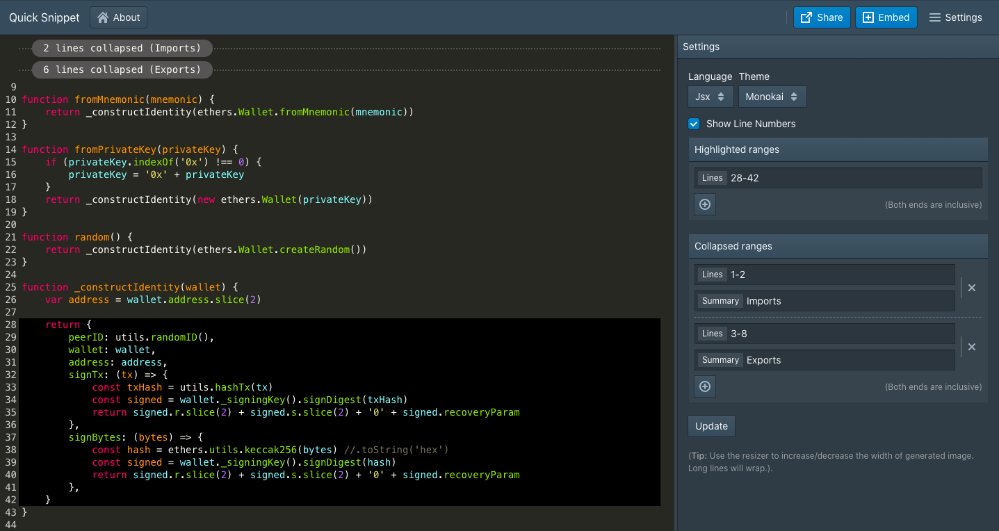

# Quick Snippet

A simple browser based utility to create **small** code snippets and share them. Unlike other pastebin/gist services, your code is not stored in any cloud storage - the shared code is simply encoded in the permalink URL.

In addition, you can: 

1. Fold/Collapse lines of boilerplate code which are not related to the primary topic
2. Highlight lines to which you want to draw attention
3. Generate images for embedding in tweets, blogs etc.

Thanks to the awesome codemirror editor, we support many themes and syntax highlighting for a large number of languages.

# Contributing

Contributions are welcome in form of bug fixes and new features (please discuss features first).

This is currently a single person's hobby project and my free time is very limited at the time so I may be slow to respond.

# License

